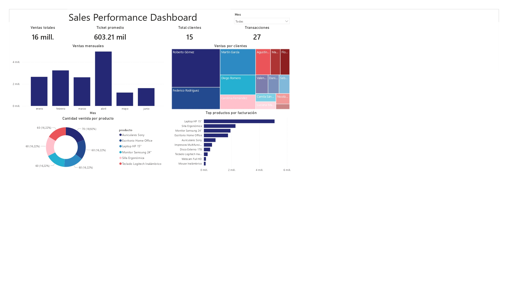

# Odoo → Power BI | Sales Performance Dashboard

Conexión entre Odoo y Power BI vía API XML-RPC con Python, con visualización de KPIs de ventas en un dashboard interactivo.

## ¿Qué hace este proyecto?

Extrae datos de ventas directamente desde Odoo usando su API XML-RPC, los transforma con Pandas y los carga en Power BI sin necesidad de archivos intermedios. El dashboard resultante permite a la dirección monitorear el rendimiento comercial en tiempo real.

## Dashboard



**KPIs visualizados:**
- Ventas totales y ticket promedio
- Cantidad de transacciones y clientes activos
- Ventas mensuales (tendencia)
- Top productos por facturación
- Ventas por cliente (treemap)
- Cantidad vendida por producto

## Stack técnico

| Herramienta | Uso |
|---|---|
| Python | Extracción y transformación de datos |
| `xmlrpc.client` | Conexión a la API de Odoo |
| Pandas | Limpieza y normalización |
| Power BI | Visualización y dashboards |

## Estructura del proyecto

```
odoo-powerbi/
├── odoo_powerbi.py        # Script principal de extracción
├── .env.example           # Template de variables de entorno
├── .gitignore
└── README.md
```

## Cómo usar

### 1. Clonar el repositorio
```bash
git clone https://github.com/tu-usuario/odoo-powerbi.git
cd odoo-powerbi
```

### 2. Instalar dependencias
```bash
pip install pandas python-dotenv
```

### 3. Configurar credenciales
```bash
cp .env.example .env
# Editar .env con tus credenciales de Odoo
```

### 4. Conectar en Power BI
En Power BI Desktop:
`Obtener datos → Python script → pegar el contenido de odoo_powerbi.py`

Power BI detecta automáticamente `df_pedidos` y `df_lineas` como tablas disponibles.

## Modelos de Odoo utilizados

| Modelo | Descripción | Campos extraídos |
|---|---|---|
| `sale.order` | Pedidos de venta | name, partner_id, date_order, amount_total, state |
| `sale.order.line` | Líneas de pedido | order_id, product_id, product_uom_qty, price_unit, price_subtotal |

## Autora

**Sol Senosiain** — Data Analyst  
[LinkedIn](https://www.linkedin.com/in/sol-senosiain/) · [Upwork](https://www.upwork.com/freelancers/~018615d93ee0d09011) · sol.senosiain@gmail.com
